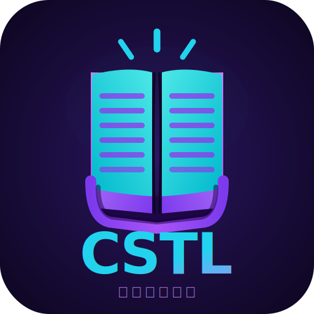

# CSTL — Copas Tool

  

  
  

Tool bantu terjemahan visual novel yang jalan di browser. Dibuat karena capek bolak-balik copy-paste manual antara file script dan AI. Semua workflow dari impor, terjemah pakai AI, kelola nama karakter, sampai ekspor bisa dilakukan di satu tempat.

---

## Fitur

### Impor
- **File / Folder** — Impor file `.json` atau `.epub` satu-satu atau sekalian satu folder
- **ZIP** — Impor banyak file sekaligus dari arsip `.zip`
- **TXT LucaSystem** — Impor script dari game berbasis LucaSystem (format `.txt` khusus), bisa file tunggal maupun folder
- **File / Folder Terjemahan** — Merge hasil terjemahan ke proyek yang sudah ada

### Terjemahan AI
Alur kerjanya sederhana: pilih baris → copy → tempel ke AI → paste hasilnya → terapkan. CSTL yang urus parsing dan mapping ke baris yang benar.

- Copy teks yang dipilih ke format siap pakai untuk ChatGPT/Gemini/dll
- Paste hasil terjemahan dan terapkan otomatis
- **AI Check** — Copy terjemahan yang sudah ada ke AI untuk dicek ulang, lalu terapkan koreksinya
- Prompt terjemahan dan AI check bisa dikustomisasi sendiri
- Pilihan format output AI (numbered list, XML, dll.)

### Glosarium
Kelola nama karakter, tempat, dan istilah khusus supaya terjemahan konsisten.

- Editor glosarium built-in
- Copy seleksi teks ke AI untuk ekstrak terminologi otomatis
- Import nama dari **VNDB** (pakai ID VN) atau **AniList** (pakai ID media)
- Ekstrak nama dari anotasi ruby di file EPUB
- Import/export glosarium ke file teks
- Preview glosarium aktif langsung di workspace

### Proofread & Pencarian
- Cari teks di semua baris — teks asli maupun terjemahan
- Support regex, case-sensitive, exact match
- Filter scope pencarian (semua baris, hanya yang dipilih, dll.)
- Replace All

### Editor Baris
Klik baris manapun untuk buka editor individual. Di sini bisa edit nama karakter, teks asli, terjemahan, dan tandai status terjemahan. Untuk proyek LucaSystem, referensi teks EN/ZH ditampilkan berdampingan.

### Seleksi
- Pilih semua, pilih range (baris X–Y), atau klik manual
- Shortcut keyboard untuk navigasi batch — bisa dikustomisasi di Setting
- Undo untuk batalkan penerapan terjemahan terakhir
- Progress bar real-time

### Pengaturan
- Bahasa sumber & target
- Jumlah baris per batch (terjemahan, glosarium, AI check)
- Jumlah baris konteks yang ikut di-copy ke AI
- Regex filter kustom
- Konfigurasi LucaSystem: profil game, nama MC, bahasa ekspor
- Tag HTML untuk parsing EPUB

### Penyimpanan
Semua proyek disimpan langsung di browser pakai **OPFS** (Origin Private File System) — tidak ada server, tidak ada akun. Proyek bisa di-backup dan dipulihkan lewat file `.cstl`.

---

## Format yang Didukung

| Format | Impor | Ekspor | Catatan |
|--------|:-----:|:------:|---------|
| `.json` | ✅ | ✅ | |
| `.epub` | ✅ | ✅ | |
| `.zip` | ✅ | — | Berisi banyak file |
| `.cstl` | ✅ | ✅ | Backup proyek |
| LucaSystem `.txt` | ✅ | ✅ | Format script khusus LucaSystem |

---

## Shortcut Keyboard

| Shortcut | Fungsi |
|----------|--------|
| `Alt + ←` | Batch seleksi sebelumnya |
| `Alt + →` | Batch seleksi berikutnya |

Shortcut bisa diubah di **Setting → Shortcut Keyboard**.

---

## Stack

Vanilla HTML + CSS + JavaScript. Tidak ada framework. Dependencies:
- **JSZip** — parsing file `.zip`
- **OPFS API** — penyimpanan lokal browser

---

## Browser

Butuh browser yang support OPFS (`navigator.storage.getDirectory()`). Chrome/Edge 102+ dan Firefox 111+ sudah pasti jalan. Safari agak terbatas.

---

## Kredit

Original dibuat oleh [Atho64](https://github.com/atho64), di-fork oleh [LuKazuu](https://github.com/LuKazuu), lalu di-fork balik dan dikembangkan lagi oleh [Atho64](https://github.com/atho64).
